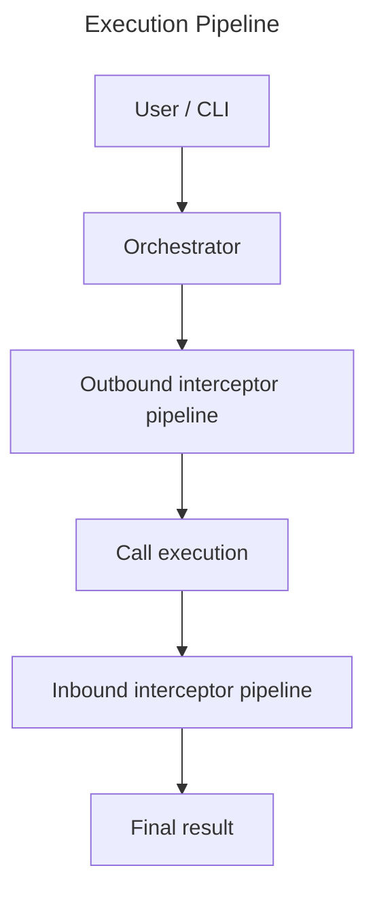
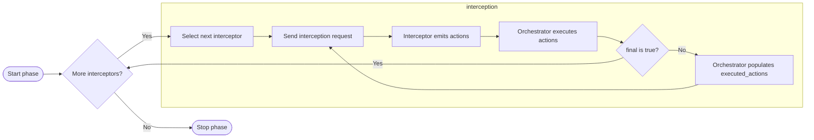

# JSON-RPC Interception Protocol

## Scope

This protocol defines deterministic orchestration of:

- outbound interception
  - request | notification
- call execution
- inbound interception
  - error | result

using **JSON-RPC 2.0** messages.

All semantics are expressed through valid RPC requests and responses.

## Architecture Overview



## Core Components

### Orchestrator

Responsible for:

- interceptor invocation
- action execution
- transcript recording
- deterministic ordering

### Interceptor

A pure decision component that:

- receives interception context
- returns
  - no action
  - action and continuation decision

Interceptors never:

- directly execute tools
- reorder pipelines

## Interceptor Pipelines

Orchestrator maintains **two independent pipelines**:

```
Outbound pipeline
Inbound pipeline
```

Each pipeline has:

- ordered interceptor list
- phase-specific membership

### Ordering Rules

- Pipeline order is fixed and deterministic.
- Order cannot be changed during execution.
- Interceptors execute sequentially.

### Interceptor Permissions

- Interceptors cannot change the order of the pipeline.
- Interceptors may disable/enable interceptors.

### Phase Isolation

Outbound and inbound pipelines are isolated:

Actions in one phase do not directly affect the other.

### Capability Scope

Each interceptor supports:

```
outbound | inbound | both
```

### View Scope

- origin
- message
- executed_actions
  - only when there is an action made

## Interception RPC Contract

**Orchestrator → Interceptor Request** (Outbound)

```json
{
  "jsonrpc": "2.0",
  "id": "<string | int | null>",
  "method": "inspect",
  "params": {
    "origin": "<string>",
    "message": "<JSON-RPC 2.0 Request>",
    "executed_actions?": [
      { "<action_name>": "<string>", "<action_params?>": "<any>" }
    ]
  }
}
```

**Orchestrator → Interceptor Request** (Inbound)

```json
{
  "jsonrpc": "2.0",
  "id": "<string | int | null>",
  "method": "inspect",
  "params": {
    "origin": "<string>",
    "message": "<JSON-RPC 2.0 Response>",
    "executed_actions?": [
      { "<action>": "<action_object>", "<result?>": "<any>" }
    ]
  }
}
```

## Interceptor Response Contract

**Interceptor → Orchestrator**

```json
{
  "jsonrpc": "2.0",
  "id": "<string | int | null>",
  "result": { "actions?": "<action_object[]>", "is_final": "<boolean>" }
}
```

## Action Object Format

```json
{
  "action": "<string>",
  "params?": "<any>"
}
```

### Rules

- Orchestrator interprets action semantics.
- Unknown actions → Orchestrator-defined error.
- Action does not encode flow control.
- Action is pure data.

## Execution Model

Per phase:



## Observability

Orchestrator records append-only transcript every message is between

- User <-> Orchestrator
- Orchestrator <-> Interceptor
- Orchestrator <-> External Methods

Immutable replayable log.

Interceptors may not mutate it.

see [Transcript](canonical_actions.md#get_transcript)

## Compliance

All messages conform to JSON-RPC 2.0

Orchestrator remains execution authority.

Interceptors declare intent only.

```

```
